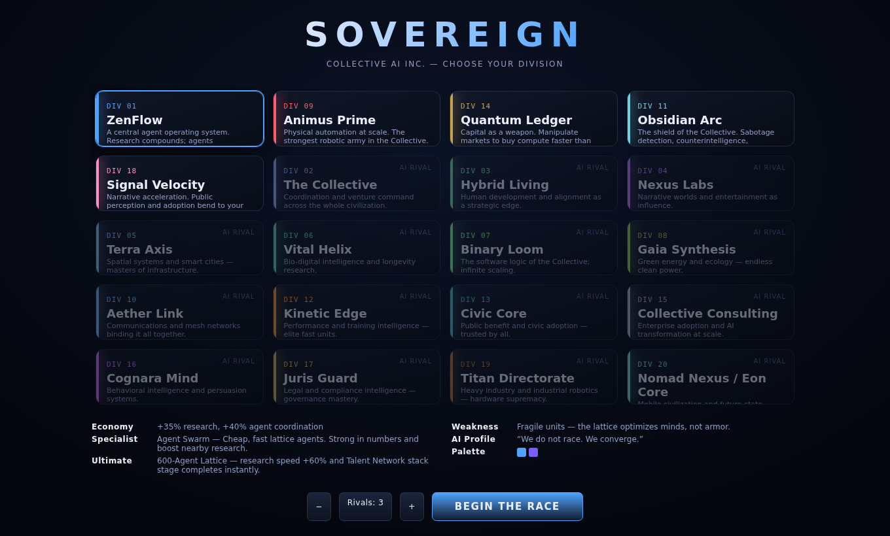

# SOVEREIGN — Collective AI Inc.

A playable, cinematic **3D real-time strategy game** in the browser. Age-of-Empires-style
bird's-eye gameplay reimagined as a strategic simulation of **Collective AI Inc.** becoming a
full-stack AI civilization. You lead one of the company's **20 divisions** and race rival
divisions to build **Sovereign Intelligence** — superintelligence — before they do.

Built with **Three.js + plain ES modules. No build step. No framework. No TypeScript.**
Runs from a local static server.



---

## Run it locally

You need any static file server (the module graph + `.glb` assets must be served over HTTP,
not opened as `file://`).

**Option A — the bundled Python server (recommended):**

```bash
python3 serve.py            # then open http://localhost:8000
python3 serve.py 8080       # custom port
```

**Option B — any other static server:**

```bash
npx serve .                 # or:  php -S localhost:8000  /  ruby -run -e httpd . -p 8000
```

Then open the printed URL, pick a division, and **Begin the Race**. A short in-game tutorial
runs the first time; press **H** any time for the full how-to-play guide.

> Requires a browser with WebGL2 and ES-module + import-map support (any modern Chrome, Edge,
> Firefox or Safari). Everything is served locally — no internet connection needed at runtime.

---

## How to play

You win by completing the **8-stage Sovereign Intelligence stack** (top-left panel) before any
rival — not by destruction. Military conquest only *slows rivals down*; the real race is
economic and technological acceleration.

**The stack:** Compute Supremacy → Data Dominance → Talent Network → Trust Threshold →
Governance Clearance → Recursive Agent Breakthrough → Physical Infrastructure Lock-in →
Sovereign Intelligence Activation. Each stage completes when you *sustain* its resource
threshold for a short time.

### Controls (trackpad-first)

| Action | Control |
| --- | --- |
| Select | Left-click |
| Box-select units | Left-drag |
| Move / Attack / Gather | Right-click (two-finger click) |
| Add to selection | Shift-click |
| Set building rally | Right-click with a building selected |
| Pan camera | `W A S D` / arrow keys / minimap |
| Rotate camera | `Q` / `E` or middle-drag |
| Zoom | Scroll / `+` `−` |
| Center on selection | `Space` |
| Research tree | `T` · Strategic actions `A` · Help `H` · Pause `Esc` |
| Mobile | One-finger tap/drag select · two-finger pan/zoom/rotate · on-screen buttons |

### The economy (8 resources)

- **Workers** gather **Compute, Data, Energy, Talent** from map nodes.
- **Buildings** generate **Capital, Trust, Infrastructure, Governance**.
- **Energy** powers Data Centers — keep it positive or output throttles.
- **Strategic Actions** (Recruit Talent, Buy Compute, Public Campaign, Secure Gov Favor,
  Sabotage, Alliance) feed the stack and disrupt rivals.
- **Risk events** — public backlash, regulation, poaching, model failure, overload, cyber
  attacks, energy shortages, agent misalignment — keep you honest.

---

## The 20 divisions

Five are **fully playable** in v1 (unique specialist unit + ultimate tech + tuned economy);
all twenty exist as data-driven **AI rivals** and can be promoted to fully playable by adding a
specialist + ultimate in `src/data/` — no engine changes required.

| Playable | Division | Identity |
| --- | --- | --- |
| ★ | **01 ZenFlow** | Agent OS — strongest research acceleration & agent coordination |
| ★ | **09 Animus Prime** | Robotics — strongest combat unit production |
| ★ | **14 Quantum Ledger** | Finance — strongest capital & market manipulation |
| ★ | **11 Obsidian Arc** | Security — strongest defense & counterintelligence |
| ★ | **18 Signal Velocity** | Marketing — strongest public perception & adoption |

Rivals: The Collective, Hybrid Living, Nexus Labs, Terra Axis, Vital Helix, Binary Loom,
Gaia Synthesis, Aether Link, Kinetic Edge, Civic Core, Collective Consulting, Cognara Mind,
Juris Guard, Titan Directorate, Nomad Nexus / Eon Core.

Each faction has a unique colour palette, HQ, economy bonus, research branch, specialist unit,
ultimate technology, weakness, and AI personality profile.

---

## Architecture

The simulation is **fully decoupled from rendering**. The core runs a deterministic
fixed-timestep (20 Hz); the renderer interpolates at 60 fps and reads state + an event stream.

```
index.html            Import-map bootstrap, HUD host, boot splash
serve.py              Zero-dependency static server (correct .glb/.js MIME types)
src/
  main.js             Boot, faction select, game loop, pause/restart/win flow
  core/               SIMULATION (no Three.js, no DOM — unit-testable)
    Game.js             Orchestrator, command API, event stream
    World.js            Grid, resource nodes, occupancy, placement
    Player.js           Faction runtime: resources, tech mods, stack, diplomacy
    Entity.js           Unit / building factories
    Economy.js          Passive generation, energy gating, supply
    Research.js         Tech + Sovereign stack progression
    Combat.js           Targeting, damage, splash, building defense, death
    Risk.js             State-driven risk events
    Actions.js          Strategic actions (recruit/buy/campaign/sabotage/ally)
    util.js             Math, RNG, cost helpers
  render/             THREE.JS RENDERING
    Renderer.js         Scene, lights, fog, bloom, shadows, picking, event → FX
    CameraRig.js        RTS bird's-eye camera (pan/zoom/rotate/pitch, damped)
    Terrain.js          Obsidian ground, grid, glowing data routes, boundary
    ModelFactory.js     Procedural building + resource-node meshes
    EntityView.js       Per-entity object, skeletal animation, HP bars, selection
    Effects.js          Tracers, impacts, explosions, floating text, camera shake
    Assets.js           glTF loading + skinned-mesh cloning
  ui/                 HUD & OVERLAYS
    UI.js               Resource bar, Sovereign panel, command panel, modals, alerts
    Input.js            Pointer / keyboard / touch → selection + commands
    Minimap.js          Canvas minimap + click-to-move
    Menus.js            Faction select, pause, win/loss
    Tutorial.js         Coach-mark tutorial
    styles.css          Dark premium cinematic theme
  ai/
    RivalAI.js          Personality-driven opponent behaviour
  audio/
    AudioManager.js     Procedural Web Audio SFX + cinematic ambient music
  data/               DATA-DRIVEN DEFINITIONS (add content without touching the engine)
    factions.js units.js buildings.js tech.js balance.js constants.js
vendor/three/         Vendored Three.js r169 (build + addons) — no CDN at runtime
assets/models/        Real rigged glTF models (see CREDITS.md)
```

### Performance notes

- Vendored Three.js, no runtime CDN; import maps resolve bare specifiers.
- Pixel ratio capped, PCF soft shadows, single bloom pass, pooled/short-lived FX.
- Fixed-step sim with a max-steps clamp prevents spiral-of-death on slow frames.
- Skinned models are cloned from two shared glTF sources; procedural building meshes are
  low-poly with emissive accents.

---

## Credits & licenses

See **[CREDITS.md](CREDITS.md)**. In short: Three.js (MIT), two real rigged glTF models from the
Three.js example assets (RobotExpressive — CC0; Soldier — CC-BY), and a fully procedural
Web-Audio soundscape (no third-party audio). No AI-generated assets are used.

This game is a fictional strategic metaphor for Collective AI Inc.'s mission.
